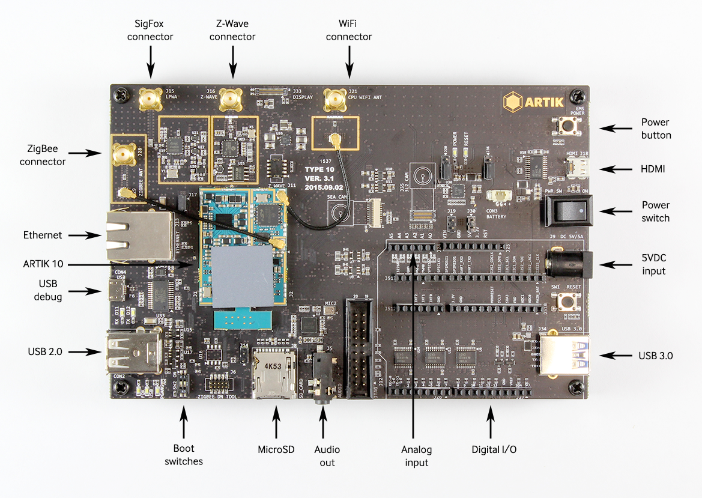

#Немного об ОС Tizen

Tizen - основанная на базе ядра Linux открытая ОС. Она предназначена для широкого круга устройств: телефонов, планшетов, телевизоров, холодильников (я не шучу) и прочей техники. Есть два способа программирования под Tizen: создание на С++ так называемых "нативных" приложений и создание веб-приложений на HTML5 и JavaScript. Второй способ легче и быстрее, поэтому он будет рассматриваться в дальнейшем.
Кстати, создание аккаунта разработчика на Tizen Store бесплатно.
#Создание веб-приложения под ОС Tizen
* Откройте Tizen IDE (Tizen Studio)
Чтобы сэкономить время, загрузим готовое приложение. В дальнейшем вы можете адаптировать и переписать его под свои нужды.
* Выберите *File -> Import* в списке выберите *Git->Projects from Git*, далее выберите *Clone URI*
* В следующем окне в поле Location вставьте адрес:
https://github.com/oljekechoro/hackathonTizenClient.git
* Жмите несколько раз *Next* и *Finish*
* В окне *Project Explorer* раскройте созданный проект и откройте файл index.html	
Этот файл описывает UI приложения как обычную веб-страницу, соответственно вы ее можете редактировать, раскрывая весь свой талант фронт-эндера. В файле *css/style.css* находятся настройки стилей этой страницы (спасибо, кэп).

```php
<!DOCTYPE html>
<html>

<head>
    <meta charset="utf-8" />
    <meta name="viewport" content="width=device-width, initial-scale=1.0, maximum-scale=1.0">
    <meta name="description" content="Tizen Mobile Web Basic Template" />

    <title>Tizen Mobile Web Basic Application</title>

    <link rel="stylesheet" type="text/css" href="css/style.css" />
    <script src="js/jquery3.11.js"></script>
    <script src="js/main.js"></script>
</head>

<body>
    <div id="main" class="page">
        <div class="contents">
           <h2>Хакатон ИУ6 и ИУ7</h2>
           <div id="ipField">
           		<p>Введите IP-адрес Raspberry Pi</p>
           		<p>в формате "ххх.ххх.ххх.ххх"</p>
           		<input type="text" name="name" id="ip" onchange="setIp()"/>
           	</div>
            <div id="field"></div>
        </div>
    </div>
</body>

</html>
```

В элемент *div* c *id = “field”* (25-строка) будет вставляться весь контент, полученный с Raspberry.
Логика веб-приложений Tizen программируется на JavaScript, файл с кодом находится по следующему пути:  *js/main.js*. Немного пройдемся по коду.

```javascript
var SERVER_URL;
var DELAY = 2000;

window.onload = function() {
    // TODO:: Do your initialization job

    // add eventListener for tizenhwkey
    document.addEventListener('tizenhwkey', function(e) {
        if (e.keyName === "back") {
            try {
                tizen.application.getCurrentApplication().exit();
            } catch (ignore) {}
        }
    });
    setInterval(getFromPi, DELAY);
};

function onError(){
	console.log("Что-то с сервером :(");
}

function setIp(){
	var a = $("#ip").val();
	SERVER_URL = a;
	getFromPi();
}

function show(data){
	window.location.replace("http://"+SERVER_URL+":5000/");
}
function getFromPi(){
	$.ajax({
		url: "http://"+SERVER_URL+":5000/",
		type: "GET",
		dataType: "text",
		success: show,
		error: onError 
	})
}
```
* *DELAY* – период обновления контента, получаемого от Raspberry
* *SERVER_URL* – адрес сервера, он инициализируется полем *input* с *id = "ip”*. Его можно захардкодить, тогда можно смело избавляться от элемента *input* и функции *setIp()*.
* Функция *getFromPi()* выполняет AJAX-запрос к Raspberry по адресу
http:// + SERVER_URL + ":5000" для проверки связи
Если у вас другой порт и страница скрипта, поменяйте адрес.
* *setInterval* на 15-строке устанавливает таймер, который по истечению *DELAY* будет вызывать функцию *getFromPi()*.
* Функция *show()* перенаправляет на страницу "http://" + SERVER_URL + ":5000" 

# Как узнать адрес Raspberry?

* В Ubuntu выполните команду *sudo nmap –sn < ip-адрес компьютера >/< маска >*.  Пример:
 *sudo nmap -sn 192.168.1.0/24*
* В Windows скачайте любое приложение, сканирующее адреса (к примеру, Advanced IP Scanner). Просканируйте сеть, в которой находится компьютер.
* В списке найдите устройство с именем, подобным “Raspberry PI”.
Если вы обнаружите несоклько микрокомпьютеров “Raspberry PI” в вашей сети, вам понадобится узнать т.н. MAC адрес устройства - уникальный идентификатор сетевого устройства, состоящий из 6 байт. Узнать его можно по команде:

```shell
ifconfig
eth0      Link encap:Ethernet  HWaddr `28:d2:44:69:2a:c8` 
```

Также вы можете определить вашу плату по уникальному имени устройства `hostname` в файле /etc/hosname:
```shell
cat /etc/hostame
host10
```
В исключительном случае вы можете обнаружить вашу плату опытным путем, отключая и подключая свой Pi к сети.


# Отладка приложения

* Если нужно отладить приложение, для отладочного вывода можно использовать *alert()* или *console.log()*. Первая будет выводить информацию в виде информационного окошка, а второй вариант осуществляет вывод информации в консоль просмотра кода веб-страницы.
* Для отладки нужно запустить приложение на веб-эмуляторе:
* Кликните на своем приложении в Project Explorer правой кнопкой, затем выберите   
*Run as -> Tizen Web Simulator Application*
* Затем, не пугайтесь, откроется Chrome с запущенным приложением. Консоль для отладки можно вызвать, кликнув правой кнопкой в любом месте и нажав *View code -> вкладка Console*

# Отправка приложения на Artik

Для выполнения данного пункта Artik и компьютер должны быть в одной сети. Подключите Artik через Ethernet кабель.

* Переключите тумблер питания (Power Switch) в положение «ВКЛ», предварительно подключив плату к питанию. 
* Подключите его к USB порту компьютера через microUSB разъем Artik’а (USB debug на рисунке). 
* Запустите Putty (в Ubuntu с помощью sudo), выберите тип подключения Serial, укажите скорость 115200 и выберите порт, к которому подключен Artik (в Ubuntu обычно */dev/ttyUSB0*) и откройте соединение. 
Если Putty на компьютере не оказалось, скачайте его в магазине приложений или по следующему адресу:
http://www.chiark.greenend.org.uk/~sgtatham/putty/download.html
* На плате нажмите на Power button и затем в терминале отобразится процесс загрузки ОС. 
* Войдите в систему под **root** c паролем **tizen**.
* Выполните команду *systemctl start sdbd_tcp*.
* С помощью команды *ifconfig* определите ip-адрес платы.
* На компьютере перейдите в папку *tools* директории Tizen IDE, в ней наберите команду *sdb connect < ip-адрес платы >*.
* Теперь нужно сгенерировать сертификат: выберите *Window -> Preferences -> Tizen SDK -> Secure Profile -> Add*. Введите любое название.
* Выберите созданный профиль и нажмите Generate. Введите произвольное название файла, алиас и пароль. На появившийся вопрос отвечайте утвердительно.
* Кликните на своем приложении в *Project Explorer* правой кнопкой, затем выберите
*Run as -> Tizen Web Application*
	Ура! Вы залили свое первое приложение! Его ярлык появится на рабочем столе

