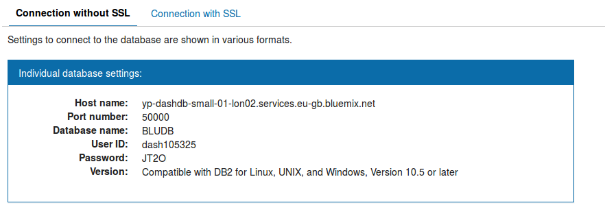
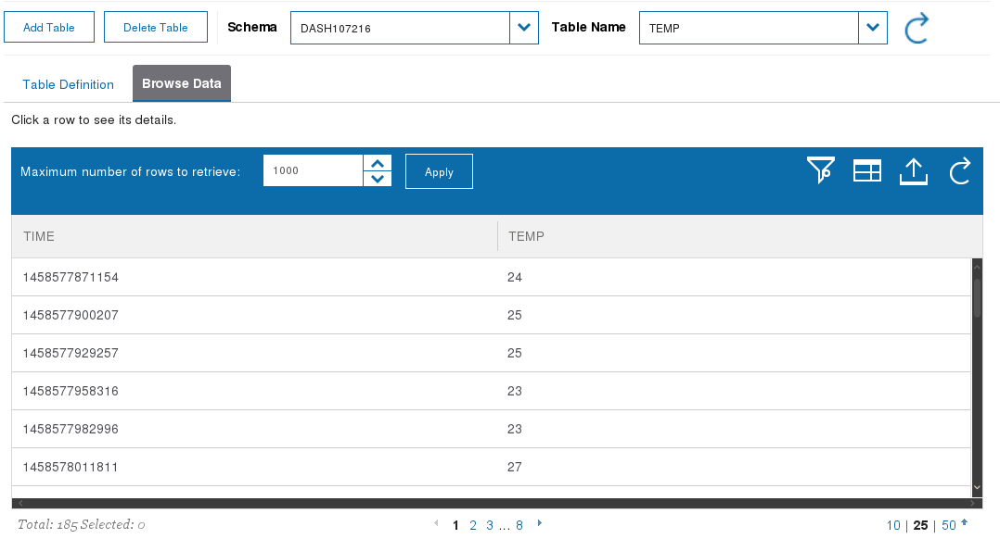
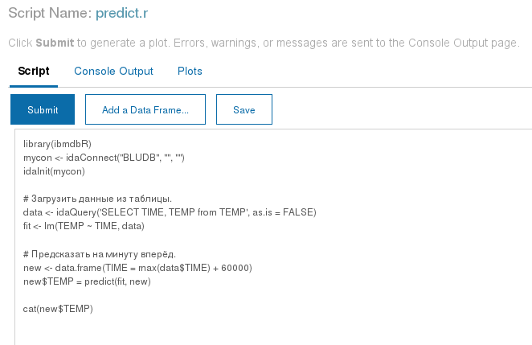
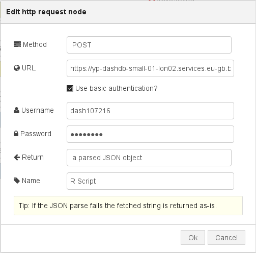
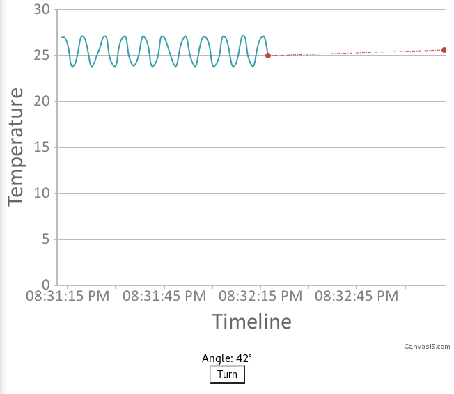

## Аналитическая обработка данных <a name="40"></a>
В этой части проекта необходимо выполнить статистическую обработку получаемых данных. Для этого потребуются следующие компоненты инфраструктуры:

- В платформе Bluemix реализовать сервис хранения данных в БД dashDB.
- Разработать структуру таблиц базы данных и SQL скрипты для добавления новых данных и удаления устаревших данных.
- Разработать поток Node-Red, реализующий запуск SQL скриптов.
- Выполнить проверку работоспособности потока с использованием консоли административной косноли dashDB.
- Выполнить разработку аналитического скрипта на языке R в среде RStudio.
- Разработать потока обработки Node-Red для запуска R скрипта.

Дополнительная информация:

[Язык программирования R](https://ru.wikibooks.org/wiki/%D0%AF%D0%B7%D1%8B%D0%BA_%D0%BF%D1%80%D0%BE%D0%B3%D1%80%D0%B0%D0%BC%D0%BC%D0%B8%D1%80%D0%BE%D0%B2%D0%B0%D0%BD%D0%B8%D1%8F_R)

[Краткая справка по командам языка R](https://cran.r-project.org/doc/contrib/Short-refcard.pdf)

[Описание IDE RStudio](https://r-analytics.blogspot.ru/p/rstudio.html#.VuiE7x_fVNA)

[Инструкции определения данных на языке DDL](https://msdn.microsoft.com/ru-ru/library/cc879262%28v=sql.120%29.aspx)

[Краткий справочник по командам SQL](https://4its.ru/html/sql-commands.html)


### Работа с сервисом dashDB <a name="41"></a>
К началу этапа рабочая область проекта представляет собой три взаимосвязанных компонента:
- Сервис IoT Foundation для реализации функций брокера MQTT.
- Сервис CloudantDB для хранения настроек IoT Foundation и Node-Red.
- Приложения JavaScript в Node-Red сервере приложений.


**Рабочая область проекта.**

Сервис dashDB представляет собой интегрированные компоненты для реализации функций хранения и аналитической обработки данных с помощью языка R. Сервис позволяет создавать и контролировать состояние SQL базы данных dashDB, содержит набор готовых скриптов на языке R, позволяет создавать и отлаживать пользовательские скрипты.

#### Добавление сервиса в проект <a name="42"></a>
Выполним добавление сервиса dashDB.
На вкладке Catalog в секции Data and Analythics необходимо выбрать сервис dashDB.


**Добавление сервиса dashDB.**

В следующем окне вводятся поля Dev, App, Service. Все поля кроме App можно оставить без изменений. В поле App в выпадающем списке выберете имя вашего приложения Node-Red. Cвязывание позволит выполнять обращения к dashDB со стороны приложений Node-Red (можно выполнить связывание позднее).


**Связывание dashDB с приложением Node-Red.**

Нажмите кнопку Create. После создания сервиса появится возможность перейти в консоль управления. Для этого нажмите на кнопку Launch.


**Консоль управления dashDB.**

Для работы с сервисом необходимо определить параметры:

* ***User ID***
* ***Host name***
* ***Password***

Указанная информация доступна на вкладке Connect в пункте Connect Information. Указанная информация понадобится впоследствии.


**Параметры для подключения к сервису dashDB.**


#### Создание таблицы <a name="43"></a>
На вкладке Tables объединены функции управления структурой базы данных. При создании сервиса автоматически создается новая база с именем, совпадающим с полем User ID (в примере: DASH105325).

Добавим в базу таблицу `TEMP` для хранения данных.

Для этого необходимо выбрать пункт Add Table и в открывшемся окне ввести код DDL.

```sql
CREATE TABLE TEMP (
  TIME BIGINT NOT NULL PRIMARY KEY,
  TEMP DOUBLE NOT NULL
);
```

Поле `TIME` предусмотрено для хранения метки времени.


#### Запуск потоковой записи первичных данных <a name="44"></a>
В приложении Node-Red необходимо связать блок IoT Foundation с функциональными блоками, формирующими структуру объекта payload, после чего передать его в блок `output/dashdb`. В блоке dashDB указать поле Service dashDB-xx (название сервиса dashDB).


**Поток обработки для записи данных в dashDB.**

Обратите внимание, что в функциональных блоках название ключей в структуре payload должно совпадать с полями таблицы базы данных.

Например:
```js
msg.payload = {
  TIME: Date.now(),
  TEMP: msg.payload
};

return msg;
```

Проверим работоспособность приложения (кнопка Deploy). В консоли управления dashDB на вкладе Tables выберете таблицу TEMP и Browse Data.
Данные от сенсоров должны быть выбаны на экран.


**Проверка работоспособности скриптов SQL в консоли dashDB.**


#### Удаление данных из таблиц <a name="45"></a>
Все полученные данные накапливаются в таблице TEMP. Так как время аналитической обработки зависит от объемов данных, выполним удаление устаревших строк из таблиц. Для этого добавим следующий поток обработки, содержащий SQL скрипты


**Удаление устаревших данных из таблиц dashDB.**

Скрипт для удаления данных старше одного часа:
```sql
DELETE FROM TEMP WHERE TIME <= (SELECT MAX(TIME) FROM TEMP) - 3600000;
```


#### Создание скрипта в RStudio <a name="46"></a>
В консоли dashDB перейти в пункты Analythics и далее R Scripts.
Выбрать пункт RStudio.


**Ввод User ID и Password для входа в RStudio.**

В результате будет открыто окно RStudio, в котором может выполняться пошаговая отладка команд на языке R.


**Окно среды RStudio.**

Подробнее о работе с IDE RStudio можно узнать [тут](https://r-analytics.blogspot.ru/p/rstudio.html#.VuiE7x_fVNA)

Выполним следующий скрипт (скрипт может быть вставлен в окно Console):

```R
library(ibmdbR)
mycon <- idaConnect("BLUDB", "", "")
idaInit(mycon)

# Загрузить данные из таблицы (запись данных в таблицу осуществляется также SQL запросом) 
data <- idaQuery('SELECT TIME, TEMP from TEMP', as.is = FALSE)
fit <- lm(TEMP ~ TIME, data)

# Предсказать на минуту вперёд 
new <- data.frame(TIME = max(data$TIME) + 60000)
new$TEMP = predict(fit, new)

cat(new$TEMP)

```

В результате скрипт будет выполнен, а все использованные фреймы могут быть проанализированы на вкладке Environment.


#### Запись скрипта в файловую систему окружения dashDB <a name="47"></a>
Для автоматического запуска разработанного скрипта необходимо сохранить его в рабочем пространстве проекта. Для этого необходимо перейти в консоль управления dashDB в пункт Analythics и пункт RScripts. Далее необходимо создать новый скрипт (+) и выполнить вставку кода R. Сохраним скрипт под именем predict.r.


**Запись скрипта.**

Также можно выполнить тестовый запуск скрипта, нажав на кнопку Submit.


### Запуск скрипта по расписанию из node-red <a name="48"></a>

В редакторе NodeRed создайте следующий поток:


**Запуск скрипта по расписанию.**

`URI creator` нужен для составления запроса:
```javascript
var source = encodeURIComponent('source("~/predict.r")');
msg.payload = 'cmd=RScriptRunScript&command='
            + source
            + '&fileName=&profileName=BLUDB&userid=dash107216';
msg.headers = {'content-type': 'application/x-www-form-urlencoded'};
return msg;
```

В данном коде необходимо заменить dash107216 на user ID пользователя dashDB (например DASH015794).



**Узел запроса.**

В данном узле необходимо выбрать способ аутентификации ([v] Use basic authentication?), в поле URL выставить правильный host name адрес dashDB приложения,  в полях Username и Password указать значения user ID и password из настроек dashDB. Интервал запуск задается в начальном узле. Для этого в поле Repeat нужно указать временной интервал между генерацией сообщений (например, 20 секунд).

### Визуализация предиктивных данных <a name="49"></a>
Разумно отображать предиктивную прямую на том же графике, что и актуальную информацию о температуре.

Добавим в функцию `socket.onmessage` обработку потока предиктивных данных:
```javascript
switch (item.topic) {
  case 'temperature':
    // ...
  case 'predicted':
    processPredicted(item.data);
    break;
}
```

И добавим поток в инициализацию библиотеки для графиков:
```javascript
var actual = [{x: new Date}];
var predicted = [];

var chart = new CanvasJS.Chart($graph, {
  axisX: {title: "Timeline"},
  axisY: {title: "Temperature"},
  data: [{
    type: "spline",
    dataPoints: actual
  }, {
    type: "line",
    dataPoints: predicted,
    lineThickness: 1,
    lineDashType: 'dashDot'
  }]
});
```

Будем отображать предиктивные данные как прямую от текущей точки к предсказанной. Поэтому `predicted` всегда будет содержать только две точки. Предсказанная точка корректируется каждый раз при поступлении новых предиктивных данных:
```javascript
function processPredicted(temp) {
  predicted[1] = {
    x: new Date(Date.now() + 60 * 1000),
    y: temp
  };

  chart.render();
}
```

А текущая (`predicted[0]`) при поступлении актуальных:
```javascript
function processTemp(temp) {
  // ...
  actual.push(point);
  predicted[0] = point;

  chart.render();
}
```


**Результат визуализации.**
